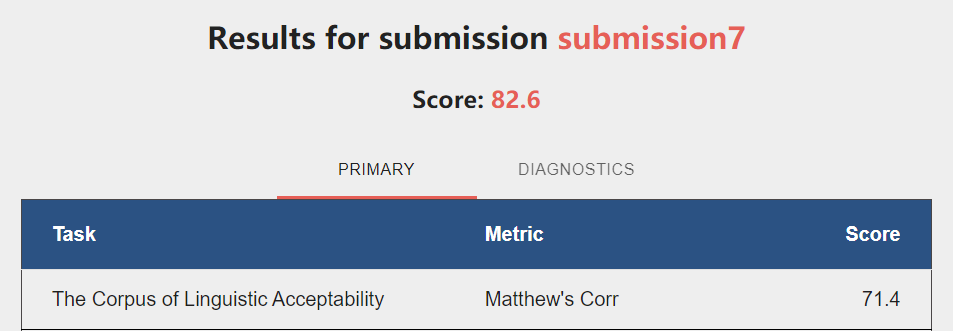

# GLUE Benchmark (CoLA)

This is the report for the course project of *Natural Language Processing*, CS229, by Prof. Hai Zhao.

* **Author:** Jiang Weibang (517030910402)
* **Email:** 935963004@sjtu.edu.cn
* **Affiliation:** ACM Honored Class, Zhiyuan College, SJTU

I will introduce the model I used for this task, whitch is Electra. And I will then showing how to run the codes. Also the result on the public GLUE benchmark is shown in the appendix at the bottom.

## Models
### Pretrained ELECTRA
ELECTRA is a new method for self-supervised language representation learning. It can be used to pre-train transformer networks using relatively little compute. ELECTRA models are trained to distinguish "real" input tokens vs "fake" input tokens generated by another neural network, similar to the discriminator of a GAN. At small scale, ELECTRA achieves strong results even when trained on a single GPU. At large scale, ELECTRA achieves state-of-the-art results on the SQuAD 2.0 dataset.


## Results
| CoLA (model) | Matthew Correlation |
|:---|:---:|
| **ELECTRA**                                     |  **71.4**   |



## Get Started
To run the code more conveniently, I wrote some shell scripts for installation, training and testing. The steps to use install the environment, training the model and testing are shown below.

### Requirements
* Python 3
* [TensorFlow](https://www.tensorflow.org/) 1.15 (although we hope to support TensorFlow 2.0 at a future date)
* [NumPy](https://numpy.org/)
* [scikit-learn](https://scikit-learn.org/stable/) and [SciPy](https://www.scipy.org/) (for computing some evaluation metrics).

### Quick-start
Environment preparation(based on Annaconda)
```
conda create -n electra python=3.7 tensorflow-gpu=1.15
conda activate electra
conda install scikit-learn
```
Download the pre-trained model
```
cd electra/data/models
wget http://storage.googleapis.com/electra-data/electra_large.zip
unzip electra_large.zip
```
Train and predict
```
cd ../..
bash train_and_predict.sh
```
The results will be wrote to CoLA.tsv in the root folder. 

## Reference
[1] Kevin Clark and Minh-Thang Luong and Quoc V. Le and Christopher D. Manning. (2020). ELECTRA: Pre-training Text Encoders as Discriminators Rather Than Generators.
